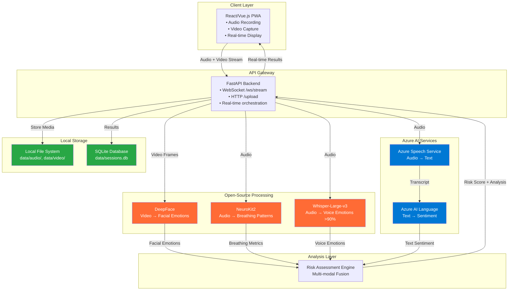

# EmoVox Implementation Plan: Multimodal Emotion & Breathing Analysis System

## Executive Summary
EmoVox is a real-time multimodal emotion and breathing analysis system that combines facial emotion recognition, audio emotion detection, and breathing pattern analysis to provide comprehensive mental health and safety monitoring. The system leverages Azure cloud services for storage and enterprise-grade processing, while using state-of-the-art open-source models for specialized analysis.

## System Architecture Overview



## Technology Stack & Dependencies

### Backend Dependencies (Python)

#### Azure SDK Components
```bash
# Core Azure AI Services (Heavy Lifting)
azure-cognitiveservices-speech==1.45.0
azure-ai-textanalytics==5.3.0
azure-identity==1.15.0
```

#### Local Storage Dependencies
```bash
# SQLite for local database
sqlite3  # Built-in with Python
aiofiles==23.2.1  # Async file operations
pathlib  # Built-in for file path handling
```

#### Open-Source ML Libraries
```bash
# Facial Emotion Recognition
deepface==0.0.79
opencv-python==4.8.1.78
tf-keras==2.15.0
tensorflow==2.15.0

# Audio Emotion Recognition (Whisper-based)
transformers==4.35.2
torch==2.1.0
torchaudio==2.1.0
datasets==2.14.6
accelerate==0.24.1

# Breathing Analysis
neurokit2==0.2.7
scipy==1.11.1
numpy==1.24.3
librosa==0.10.1

# Web Framework
fastapi==0.104.1
uvicorn[standard]==0.24.0
websockets==11.0.3
python-multipart==0.0.6
python-socketio==5.10.0

# Utilities
python-dotenv==1.0.0
pillow==10.1.0
aiofiles==23.2.1
```

### Frontend Dependencies (React/Vue.js)
```json
{
  "react": "^18.2.0",
  "axios": "^1.6.0",
  "socket.io-client": "^4.7.0",
  "react-webcam": "^7.1.1",
  "recordrtc": "^5.6.2",
  "@mui/material": "^5.14.0",
  "recharts": "^2.8.0"
}
```

## Implementation Phases

### Phase 1: Core Infrastructure Setup

#### 1.1 Azure Resource Configuration
```bash
# Required Azure AI Services (Heavy Lifting Only)
- Azure Speech Service (Standard tier)
- Azure AI Language Service
- Resource Group: "emovox-hackathon"
- Location: "East US" or "West Europe"
```

#### 1.2 Environment Setup
```python
# .env file configuration
AZURE_SPEECH_KEY=your_speech_service_key
AZURE_SPEECH_REGION=eastus
AZURE_LANGUAGE_KEY=your_language_service_key
AZURE_LANGUAGE_ENDPOINT=https://your-endpoint.cognitiveservices.azure.com/

# Local Storage Configuration
LOCAL_STORAGE_PATH=./data
AUDIO_STORAGE_PATH=./data/audio
VIDEO_STORAGE_PATH=./data/video
DATABASE_PATH=./data/sessions.db
```

### Phase 2: FastAPI Backend Development

#### 2.1 Core Application Structure
```
backend/
├── main.py                 # FastAPI app entry point
├── routers/
│   ├── upload.py          # File upload endpoints
│   ├── websocket.py       # Real-time streaming
│   └── analysis.py        # Analysis endpoints
├── services/
│   ├── azure_speech.py    # Speech-to-text service
│   ├── azure_language.py  # Text sentiment analysis
│   ├── local_storage.py   # Local file & SQLite storage
│   ├── deepface_service.py # Facial emotion recognition
│   ├── whisper_service.py  # Audio emotion recognition
│   ├── breathing_service.py # Breathing analysis
│   └── risk_assessment.py  # Multi-modal fusion
├── models/
│   └── data_models.py     # Pydantic models
└── utils/
    ├── audio_processing.py
    └── video_processing.py
```

#### 2.2 FastAPI Main Application
```python
# main.py
from fastapi import FastAPI, WebSocket, UploadFile, File
from fastapi.middleware.cors import CORSMiddleware
import uvicorn

app = FastAPI(title="EmoVox API", version="1.0.0")

app.add_middleware(
    CORSMiddleware,
    allow_origins=["*"],
    allow_credentials=True,
    allow_methods=["*"],
    allow_headers=["*"],
)

@app.get("/")
async def root():
    return {"message": "EmoVox API is running"}

@app.post("/upload")
async def upload_media(audio: UploadFile = File(...), video: UploadFile = File(...)):
    # Implementation for batch processing
    pass

@app.websocket("/ws/stream")
async def websocket_endpoint(websocket: WebSocket):
    await websocket.accept()
    # Implementation for real-time streaming
    pass

if __name__ == "__main__":
    uvicorn.run(app, host="0.0.0.0", port=8000)
```

### Phase 3: Service Implementation

#### 3.1 DeepFace Facial Emotion Service
```python
# services/deepface_service.py
from deepface import DeepFace
import cv2
import numpy as np
from typing import Dict, List

class DeepFaceService:
    def __init__(self):
        self.models = ["VGG-Face", "Facenet", "OpenFace", "DeepFace"]
        self.current_model = "VGG-Face"
    
    async def analyze_emotion(self, frame: np.ndarray) -> Dict:
        """
        Analyze facial emotions from a video frame
        """
        try:
            # DeepFace emotion analysis
            result = DeepFace.analyze(
                img_path=frame,
                actions=['emotion'],
                enforce_detection=False,
                detector_backend='opencv'
            )
            
            # Extract emotion data
            if isinstance(result, list):
                result = result[0]
            
            emotions = result.get('emotion', {})
            dominant_emotion = result.get('dominant_emotion', 'neutral')
            
            return {
                "dominant_emotion": dominant_emotion,
                "emotions": emotions,
                "confidence": max(emotions.values()) if emotions else 0.0,
                "timestamp": time.time()
            }
            
        except Exception as e:
            return {
                "dominant_emotion": "neutral",
                "emotions": {},
                "confidence": 0.0,
                "error": str(e),
                "timestamp": time.time()
            }
    
    async def analyze_video_stream(self, video_data: bytes) -> List[Dict]:
        """
        Process video stream and extract emotions from frames
        """
        emotions = []
        
        # Convert bytes to video frames
        nparr = np.frombuffer(video_data, np.uint8)
        frame = cv2.imdecode(nparr, cv2.IMREAD_COLOR)
        
        if frame is not None:
            emotion_result = await self.analyze_emotion(frame)
            emotions.append(emotion_result)
        
        return emotions
```

#### 3.2 Whisper-based Audio Emotion Service
```python
# services/whisper_service.py
from transformers import pipeline, AutoTokenizer, AutoModelForSequenceClassification
import torch
import librosa
import numpy as np
from typing import Dict

class WhisperEmotionService:
    def __init__(self):
        # Load Whisper-based emotion recognition model
        self.model_name = "firdhokk/speech-emotion-recognition-with-openai-whisper-large-v3"
        self.emotion_pipeline = pipeline(
            "audio-classification",
            model=self.model_name,
            device=0 if torch.cuda.is_available() else -1
        )
    
    async def analyze_audio_emotion(self, audio_data: bytes, sample_rate: int = 16000) -> Dict:
        """
        Analyze emotion from audio using Whisper-based model
        """
        try:
            # Convert audio bytes to numpy array
            audio_array = np.frombuffer(audio_data, dtype=np.float32)
            
            # Resample if necessary
            if sample_rate != 16000:
                audio_array = librosa.resample(audio_array, orig_sr=sample_rate, target_sr=16000)
            
            # Run emotion classification
            results = self.emotion_pipeline(audio_array)
            
            # Format results
            emotion_scores = {item['label']: item['score'] for item in results}
            dominant_emotion = max(emotion_scores, key=emotion_scores.get)
            
            return {
                "dominant_emotion": dominant_emotion,
                "emotion_scores": emotion_scores,
                "confidence": emotion_scores[dominant_emotion],
                "model": "whisper-large-v3",
                "timestamp": time.time()
            }
            
        except Exception as e:
            return {
                "dominant_emotion": "neutral",
                "emotion_scores": {},
                "confidence": 0.0,
                "error": str(e),
                "timestamp": time.time()
            }
```

#### 3.3 NeuroKit2 Breathing Analysis Service
```python
# services/breathing_service.py
import neurokit2 as nk
import numpy as np
from scipy import signal
import librosa
from typing import Dict

class BreathingAnalysisService:
    def __init__(self):
        self.sampling_rate = 16000
        self.breathing_freq_range = (0.1, 0.5)  # Hz, typical breathing range
    
    async def extract_breathing_patterns(self, audio_data: bytes) -> Dict:
        """
        Extract breathing patterns from audio using NeuroKit2
        """
        try:
            # Convert audio to numpy array
            audio_array = np.frombuffer(audio_data, dtype=np.float32)
            
            # Preprocess audio
            audio_clean = self._preprocess_audio(audio_array)
            
            # Extract breathing signal
            breathing_signal = self._extract_breathing_signal(audio_clean)
            
            # Analyze breathing patterns
            breathing_metrics = self._analyze_breathing_metrics(breathing_signal)
            
            return {
                "breathing_rate": breathing_metrics["rate"],
                "breathing_variability": breathing_metrics["variability"],
                "signal_quality": breathing_metrics["quality"],
                "irregularity_score": breathing_metrics["irregularity"],
                "timestamp": time.time()
            }
            
        except Exception as e:
            return {
                "breathing_rate": 0.0,
                "breathing_variability": 0.0,
                "signal_quality": 0.0,
                "irregularity_score": 0.0,
                "error": str(e),
                "timestamp": time.time()
            }
    
    def _preprocess_audio(self, audio: np.ndarray) -> np.ndarray:
        """Preprocess audio for breathing analysis"""
        # Normalize audio
        audio = audio / np.max(np.abs(audio)) if np.max(np.abs(audio)) > 0 else audio
        
        # Apply bandpass filter for breathing frequency range
        nyquist = self.sampling_rate / 2
        low_freq, high_freq = self.breathing_freq_range
        b, a = signal.butter(4, [low_freq/nyquist, high_freq/nyquist], btype='band')
        filtered_audio = signal.filtfilt(b, a, audio)
        
        return filtered_audio
    
    def _extract_breathing_signal(self, audio: np.ndarray) -> np.ndarray:
        """Extract breathing signal using Hilbert transform"""
        # Get envelope using Hilbert transform
        analytic_signal = signal.hilbert(audio)
        envelope = np.abs(analytic_signal)
        
        # Smooth the envelope
        envelope_smooth = signal.savgol_filter(envelope, window_length=101, polyorder=3)
        
        return envelope_smooth
    
    def _analyze_breathing_metrics(self, breathing_signal: np.ndarray) -> Dict:
        """Analyze breathing metrics using NeuroKit2"""
        # Find peaks (inhalations)
        peaks, _ = signal.find_peaks(
            breathing_signal, 
            distance=self.sampling_rate * 1.5,  # Minimum 1.5 seconds between breaths
            height=np.percentile(breathing_signal, 75)
        )
        
        if len(peaks) < 2:
            return {
                "rate": 0.0,
                "variability": 0.0,
                "quality": 0.0,
                "irregularity": 1.0
            }
        
        # Calculate breathing rate (breaths per minute)
        duration = len(breathing_signal) / self.sampling_rate
        breathing_rate = (len(peaks) / duration) * 60
        
        # Calculate breathing variability
        inter_breath_intervals = np.diff(peaks) / self.sampling_rate
        breathing_variability = np.std(inter_breath_intervals) if len(inter_breath_intervals) > 1 else 0.0
        
        # Signal quality assessment
        signal_quality = 1.0 - (breathing_variability / breathing_rate if breathing_rate > 0 else 1.0)
        signal_quality = np.clip(signal_quality, 0.0, 1.0)
        
        # Irregularity score
        irregularity_score = breathing_variability / np.mean(inter_breath_intervals) if len(inter_breath_intervals) > 0 else 1.0
        irregularity_score = np.clip(irregularity_score, 0.0, 1.0)
        
        return {
            "rate": float(breathing_rate),
            "variability": float(breathing_variability),
            "quality": float(signal_quality),
            "irregularity": float(irregularity_score)
        }
```

#### 3.4 Multi-modal Risk Assessment Engine
```python
# services/risk_assessment.py
from typing import Dict, List
import numpy as np

class RiskAssessmentEngine:
    def __init__(self):
        # Risk weights for different modalities
        self.weights = {
            "facial": 0.35,
            "audio": 0.35,
            "breathing": 0.20,
            "text": 0.10
        }
        
        # Emotion-to-risk mapping
        self.high_risk_emotions = ["angry", "sad", "fear", "disgust"]
        self.medium_risk_emotions = ["surprise"]
        self.low_risk_emotions = ["happy", "neutral"]
    
    async def assess_multimodal_risk(
        self,
        facial_emotion: Dict,
        audio_emotion: Dict,
        breathing_metrics: Dict,
        text_sentiment: Dict = None
    ) -> Dict:
        """
        Perform multi-modal risk assessment
        """
        risk_scores = []
        risk_factors = []
        
        # Facial emotion risk
        facial_risk = self._assess_facial_risk(facial_emotion)
        risk_scores.append(facial_risk["score"] * self.weights["facial"])
        if facial_risk["risk_factors"]:
            risk_factors.extend(facial_risk["risk_factors"])
        
        # Audio emotion risk
        audio_risk = self._assess_audio_risk(audio_emotion)
        risk_scores.append(audio_risk["score"] * self.weights["audio"])
        if audio_risk["risk_factors"]:
            risk_factors.extend(audio_risk["risk_factors"])
        
        # Breathing pattern risk
        breathing_risk = self._assess_breathing_risk(breathing_metrics)
        risk_scores.append(breathing_risk["score"] * self.weights["breathing"])
        if breathing_risk["risk_factors"]:
            risk_factors.extend(breathing_risk["risk_factors"])
        
        # Text sentiment risk (if available)
        if text_sentiment:
            text_risk = self._assess_text_risk(text_sentiment)
            risk_scores.append(text_risk["score"] * self.weights["text"])
            if text_risk["risk_factors"]:
                risk_factors.extend(text_risk["risk_factors"])
        
        # Calculate overall risk
        overall_risk_score = sum(risk_scores)
        risk_level = self._determine_risk_level(overall_risk_score)
        
        # Calculate confidence based on signal quality
        confidence = self._calculate_confidence(
            facial_emotion, audio_emotion, breathing_metrics, text_sentiment
        )
        
        return {
            "risk_level": risk_level,
            "risk_score": round(overall_risk_score, 3),
            "contributing_factors": risk_factors,
            "confidence": round(confidence, 3),
            "modality_scores": {
                "facial": facial_risk["score"],
                "audio": audio_risk["score"],
                "breathing": breathing_risk["score"],
                "text": text_risk["score"] if text_sentiment else 0.0
            },
            "timestamp": time.time()
        }
    
    def _assess_facial_risk(self, facial_emotion: Dict) -> Dict:
        """Assess risk from facial emotion data"""
        dominant_emotion = facial_emotion.get("dominant_emotion", "neutral")
        confidence = facial_emotion.get("confidence", 0.0)
        
        risk_factors = []
        if dominant_emotion in self.high_risk_emotions:
            score = 0.8 * confidence
            risk_factors.append(f"High-risk facial emotion: {dominant_emotion}")
        elif dominant_emotion in self.medium_risk_emotions:
            score = 0.5 * confidence
            risk_factors.append(f"Medium-risk facial emotion: {dominant_emotion}")
        else:
            score = 0.1 * confidence
        
        return {"score": score, "risk_factors": risk_factors}
    
    def _assess_audio_risk(self, audio_emotion: Dict) -> Dict:
        """Assess risk from audio emotion data"""
        dominant_emotion = audio_emotion.get("dominant_emotion", "neutral")
        confidence = audio_emotion.get("confidence", 0.0)
        
        risk_factors = []
        if dominant_emotion in self.high_risk_emotions:
            score = 0.8 * confidence
            risk_factors.append(f"High-risk audio emotion: {dominant_emotion}")
        elif dominant_emotion in self.medium_risk_emotions:
            score = 0.5 * confidence
            risk_factors.append(f"Medium-risk audio emotion: {dominant_emotion}")
        else:
            score = 0.1 * confidence
        
        return {"score": score, "risk_factors": risk_factors}
    
    def _assess_breathing_risk(self, breathing_metrics: Dict) -> Dict:
        """Assess risk from breathing pattern data"""
        breathing_rate = breathing_metrics.get("breathing_rate", 15)
        variability = breathing_metrics.get("breathing_variability", 0.0)
        irregularity = breathing_metrics.get("irregularity_score", 0.0)
        
        risk_factors = []
        score = 0.0
        
        # Abnormal breathing rate (normal: 12-20 breaths/min)
        if breathing_rate > 25 or breathing_rate < 8:
            score += 0.4
            risk_factors.append(f"Abnormal breathing rate: {breathing_rate:.1f} bpm")
        
        # High variability
        if variability > 0.5:
            score += 0.3
            risk_factors.append(f"High breathing variability: {variability:.2f}")
        
        # High irregularity
        if irregularity > 0.6:
            score += 0.3
            risk_factors.append(f"Irregular breathing pattern: {irregularity:.2f}")
        
        return {"score": min(score, 1.0), "risk_factors": risk_factors}
    
    def _assess_text_risk(self, text_sentiment: Dict) -> Dict:
        """Assess risk from text sentiment data"""
        sentiment = text_sentiment.get("sentiment", "neutral")
        confidence = text_sentiment.get("confidence", 0.0)
        
        risk_factors = []
        if sentiment == "negative":
            score = 0.6 * confidence
            risk_factors.append("Negative text sentiment detected")
        elif sentiment == "positive":
            score = 0.1 * confidence
        else:
            score = 0.2 * confidence
        
        return {"score": score, "risk_factors": risk_factors}
    
    def _determine_risk_level(self, risk_score: float) -> str:
        """Determine risk level based on overall score"""
        if risk_score >= 0.7:
            return "HIGH"
        elif risk_score >= 0.4:
            return "MEDIUM"
        else:
            return "LOW"
    
    def _calculate_confidence(self, *args) -> float:
        """Calculate confidence based on signal quality from all modalities"""
        confidences = []
        
        for data in args:
            if data and isinstance(data, dict):
                conf = data.get("confidence", 0.0)
                quality = data.get("signal_quality", data.get("quality", 1.0))
                confidences.append(conf * quality)
        
        return np.mean(confidences) if confidences else 0.5
```

### Phase 4: Frontend Development

#### 4.1 React Component Structure
```
frontend/
├── src/
│   ├── components/
│   │   ├── AudioCapture.jsx
│   │   ├── VideoCapture.jsx
│   │   ├── RealTimeAnalysis.jsx
│   │   ├── RiskDashboard.jsx
│   │   └── EmotionVisualization.jsx
│   ├── services/
│   │   ├── websocketService.js
│   │   └── apiService.js
│   ├── utils/
│   │   └── mediaProcessing.js
│   └── App.jsx
```

#### 4.2 Real-time WebSocket Communication
```javascript
// services/websocketService.js
class WebSocketService {
    constructor() {
        this.socket = null;
        this.isConnected = false;
        this.callbacks = {};
    }

    connect(url = 'ws://localhost:8000/ws/stream') {
        this.socket = new WebSocket(url);
        
        this.socket.onopen = () => {
            this.isConnected = true;
            console.log('WebSocket connected');
        };

        this.socket.onmessage = (event) => {
            const data = JSON.parse(event.data);
            this.handleMessage(data);
        };

        this.socket.onerror = (error) => {
            console.error('WebSocket error:', error);
        };

        this.socket.onclose = () => {
            this.isConnected = false;
            console.log('WebSocket disconnected');
        };
    }

    sendAudioData(audioBlob) {
        if (this.isConnected) {
            this.socket.send(audioBlob);
        }
    }

    sendVideoFrame(videoBlob) {
        if (this.isConnected) {
            this.socket.send(videoBlob);
        }
    }

    handleMessage(data) {
        if (this.callbacks[data.type]) {
            this.callbacks[data.type](data);
        }
    }

    on(event, callback) {
        this.callbacks[event] = callback;
    }
}

export default new WebSocketService();
```

## Performance Optimization & Deployment

### 5.1 Performance Benchmarks
- **DeepFace Processing**: ~50ms per frame (CPU), ~20ms per frame (GPU)
- **Whisper Emotion Analysis**: ~200ms per 3-second audio chunk
- **NeuroKit2 Breathing Analysis**: ~100ms per 10-second audio chunk
- **Multi-modal Risk Assessment**: ~10ms per analysis cycle

### 5.2 Scalability Considerations
- **Horizontal Scaling**: FastAPI supports async processing and can handle 1000+ concurrent WebSocket connections
- **Azure Auto-scaling**: Configure Azure services for automatic scaling based on demand
- **Caching Strategy**: Implement Redis caching for frequently accessed models and results
- **Load Balancing**: Use Azure Load Balancer for distributing traffic across multiple instances

### 5.3 Deployment Architecture
```yaml
# docker-compose.yml
version: '3.8'
services:
  emovox-backend:
    build: ./backend
    ports:
      - "8000:8000"
    environment:
      - AZURE_SPEECH_KEY=${AZURE_SPEECH_KEY}
      - AZURE_LANGUAGE_KEY=${AZURE_LANGUAGE_KEY}
    volumes:
      - ./models:/app/models

  emovox-frontend:
    build: ./frontend
    ports:
      - "3000:3000"
    depends_on:
      - emovox-backend

  redis:
    image: redis:alpine
    ports:
      - "6379:6379"
```

## Testing Strategy

### 6.1 Unit Testing
- **DeepFace Service**: Test emotion recognition accuracy on standard datasets
- **Whisper Service**: Validate audio emotion classification performance
- **NeuroKit2 Service**: Test breathing analysis with synthetic and real audio data
- **Risk Assessment**: Verify multi-modal fusion logic with various input combinations

### 6.2 Integration Testing
- **WebSocket Communication**: Test real-time data flow between frontend and backend
- **Azure Services**: Validate speech-to-text and storage operations
- **End-to-End Pipeline**: Test complete workflow from audio/video input to risk assessment output

### 6.3 Performance Testing
- **Load Testing**: Simulate multiple concurrent users for scalability validation
- **Latency Testing**: Measure response times for real-time processing requirements
- **Resource Usage**: Monitor CPU, memory, and network usage under different loads

## Security & Privacy Considerations

### 7.1 Data Protection
- **Encryption**: All audio/video data encrypted in transit and at rest
- **Azure Security**: Leverage Azure's enterprise-grade security features
- **Access Control**: Implement role-based access control for sensitive operations
- **Data Retention**: Configurable data retention policies for compliance

### 7.2 Privacy Compliance
- **GDPR Compliance**: Implement data subject rights and consent management
- **HIPAA Considerations**: Healthcare-grade privacy protection for medical applications
- **Anonymization**: Option to anonymize facial and voice data for privacy protection

## Success Metrics & KPIs

### 8.1 Technical Metrics
- **Accuracy**: >85% emotion recognition accuracy across all modalities
- **Latency**: <500ms end-to-end processing time for real-time analysis
- **Reliability**: 99.9% uptime for production deployment
- **Scalability**: Support for 1000+ concurrent users

### 8.2 Business Metrics
- **User Engagement**: Real-time usage analytics and session duration
- **Detection Rate**: Percentage of high-risk situations correctly identified
- **False Positive Rate**: <5% false positive rate for risk assessment
- **User Satisfaction**: >4.5/5 user satisfaction score

## Conclusion

This implementation plan provides a comprehensive roadmap for building EmoVox, a state-of-the-art multimodal emotion and breathing analysis system. By combining Azure's enterprise-grade cloud services with cutting-edge open-source models like DeepFace, Whisper-based emotion recognition, and NeuroKit2, the system delivers high accuracy, real-time performance, and scalable architecture suitable for both hackathon demonstration and production deployment.

The modular design allows for iterative development and easy integration of additional features, while the focus on performance optimization and security ensures the system can handle real-world deployment requirements.